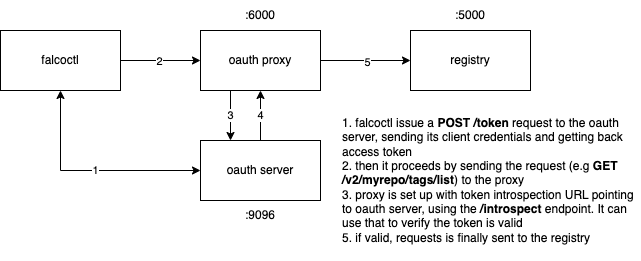

# oauth

This little project is the home of a test OAuth2.0 server for `falcoctl` and `oras-go`.



## PoC

First of all, build the container in the nginx folder and start it

```shell
$ cd nginx && docker build -t loresuso/oauth-proxy .
$ docker run --rm -it --net=host loresuso/oauth-proxy
```

Then, start the OAuth2.0 server
```shell
$ go run server.go
```

The server can perform all possible OAuh2.0 grant types. Regarding the client credentials flow, 
the server can authenticate a client app having `000000` and `999999` as client ID and client secret, respectively.
Take this in mind if you want later use `falcoctl`:

```shell
$ falcoctl registry oauth  --client-id=000000 --client-secret=999999  --token-url="http://localhost:9096/token" --scopes="my-scope"
```

The above command save client credentials in the filesystem, so that can be used later on.

Then, start an OCI registry

```shell
$ docker run -it --rm -p 5000:5000 --name registry registry:2
```

Lastly, run falcoctl (remember to use oauth and plain http for testing)

```shell
$ falcoctl registry push ...
```


