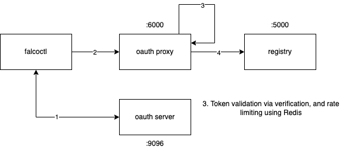

# falcoctl registries

*Notice: this is a WIP repository. Use with caution!*

This little project is the home of a test OAuth2.0 server for `falcoctl` and `oras-go`.

## PoC

<!--  -->

This repository will setup 2 registries:

- an *HTTP Basic Authentication* registry on port 5001 (default user and password are user:password)
- an *OAuth* registry on port 5000 (default id and secret are 000000:999999)

Plus a web server to server to serve indexes (stores in the `indexes` folder) on port 8000.

### TL;DR

You'll need:
- `docker`
- `docker-compose`
- `mkcert`

Then you only have to run:
```shell
$ ./run.sh
```

Then, try out 
```shell 
# falcoctl registry oauth --client-id=000000 --client-secret=999999 --token-url "http://localhost:9096/token"
# falcoctl registry push localhost:6000/test:7.0.0 --type plugin --platform linux/x86 /tmp/triage.scap --oauth --plain-http
# falcoctl registry pull localhost:6000/test:7.0.0 --oauth --plain-http --platform linux/x86
```

<!--
### Complete flow explained

Signed JWTs allows the proxy to verify authenticity and the integrity of a JWT token. For the sake of simplicity, this PoC uses HMAC as signing algorithm, and verification happens by using a shared common secret between proxy and Oauth server. Any other (and more robust) signing algorithm can be used for production use cases. 

First of all, let's launch also the OAuth server:
```shell
$ go run server.go
```

Then, let `falcoctl` store client credentials, so that it can be able to make authenticated requests later:

```shell
$ ./falcoctl registry oauth --client-id=000000 --client-secret=999999 --token-url "http://localhost:9096/token"
```
This will validate the client credentials and, if so, they will be stored in a file for later use. 

Then, start a Redis server:
```shell
$ docker run --rm --name my-redis-container -p 6379:6379 -d redis
```
This is used to implement a very simple rate limiting algorithm by making use of `INCR` and `EXPIRE`. 
Keys are composed by `clientID | currentMinute`. We keep increasing a counter everytime a client hit our proxy with a request in a given minute. If the counter goes beyond a threshold, we do not pass the request to the registry. We also set the `EXPIRE` everytime this key is hit, and this is set to 59 seconds. This way, when we will roll from minute 59 to 00, we are sure that the key for that minute was expired and we can start increasing the counter for the first minute of the new hour.

Then, start also a container registry:
```shell
$ docker run --rm -it --name=registry -p 5000:5000 registry
```
Keep it in another terminal so that you can see what kind of operations are performed on it, for debugging purposes. 

The last piece needed is a reverse proxy server written in Go, that can perform token validation and rate limiting:
```shell
$ go run proxy.go
```

Now you can see that you can be able to push and pull artifacts using `falcoctl`:
```shell
$ ./falcoctl registry push localhost:6000/test:7.0.0 --type plugin --platform linux/x86 /tmp/triage.scap --oauth --plain-http
$ ./falcoctl registry pull localhost:6000/test:7.0.0 --oauth --plain-http --platform linux/x86
```

Rate limit is set to 15 requests per minute.
-->
